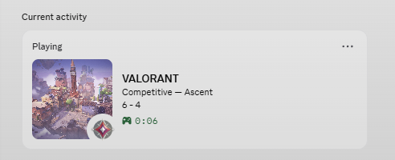
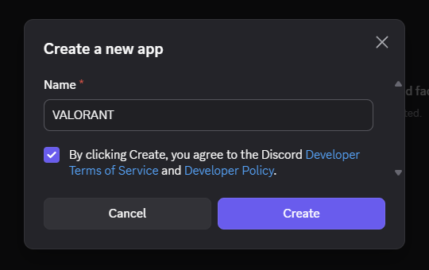
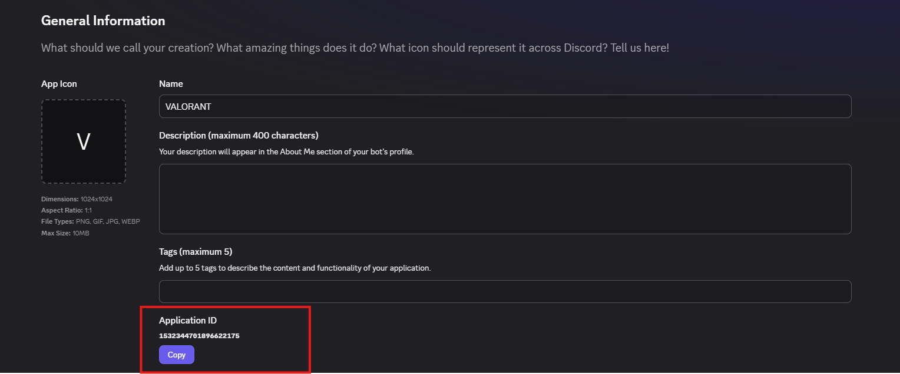
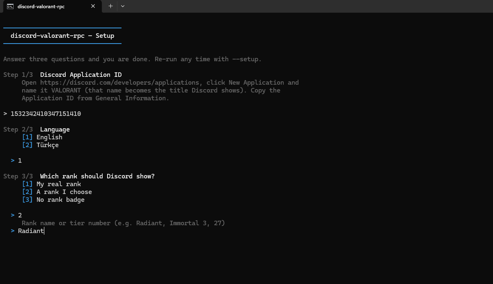

<div align="center">

# discord-valorant-rpc

**Discord Rich Presence for VALORANT — and you pick the rank it shows.**

[](https://github.com/canbedir/discord-valorant-rpc/actions/workflows/ci.yml)
[](https://github.com/canbedir/discord-valorant-rpc/releases/latest)
[](https://github.com/canbedir/discord-valorant-rpc/releases)
[](LICENSE)
[](#)
[](package.json)


</div>




No dependencies, no build step, no Riot login. Set it up once from the console
and forget about it.

## Install

### Download (easiest)

1. Grab the latest zip from [**Releases**](https://github.com/canbedir/discord-valorant-rpc/releases/latest) and extract it anywhere.
2. Double-click **`start.bat`**. If Node.js is missing it offers to install it for you.
3. The console walks you through the rest — Application ID, language, rank.

### From source

```bash
git clone https://github.com/canbedir/discord-valorant-rpc
cd discord-valorant-rpc
npm start
```

## First run

Everything happens in the console except creating the Discord application, which
takes a minute in the browser.

**1. Create the app.** Go to
[discord.com/developers/applications](https://discord.com/developers/applications)
→ **New Application** and name it **`VALORANT`**. That name is the title Discord
displays, so anything else will show up instead.



**2. Copy the Application ID** from *General Information*. It is the long number
— not a bot token, not the public key.



**3. Run it.** The wizard asks for that ID, then your language and which rank to
show:



That's it. Re-run the wizard any time with `npm run setup`.

## Changing the rank

While it's running, press **`r`**. Pick a new rank, and Discord updates
immediately — no restart.

| Mode | Shows |
| --- | --- |
| My real rank | Whatever the game reports |
| A rank I choose | Any tier, from Unranked to Radiant |
| No rank badge | Nothing |

Rank names and tier numbers both work: `Radiant`, `Immortal 3`, `27`.
`npm run ranks` lists them all.

Press **`q`** to quit.

## Settings

Everything the wizard writes lives in `config.json`, and there are a few extras
you can only set by editing it:

```json
{
  "discordClientId": "1234567890123456789",
  "language": "en",
  "pollIntervalMs": 3000,

  "rank": {
    "mode": "real",
    "override": "Radiant",
    "leaderboardPosition": 0
  },

  "display": {
    "showScore": true,
    "showParty": true,
    "showAccountLevel": false,
    "showRankInMenus": true,
    "largeImage": "map",
    "buttons": []
  },

  "idle": {
    "showWhenGameClosed": false,
    "text": "VALORANT closed"
  }
}
```

- **`rank.leaderboardPosition`** — above zero shows `Radiant #3`
- **`display.largeImage`** — `map` (map in a match, player card in menus), `card`, or `rank`
- **`display.buttons`** — up to two: `[{ "label": "Profile", "url": "https://..." }]`
- **`language`** — `en` or `tr`, applies to both Discord and the console

## Commands

```bash
npm start          # run it
npm run setup      # re-run the wizard
npm run ranks      # list every rank name
npm run demo       # preview in Discord without launching VALORANT
npm run debug      # verbose output
npm test           # run the test suite
```

## Troubleshooting

**Nothing appears in Discord.** Discord → Settings → **Activity Privacy** →
"Share your detected activities" has to be on. You also can't see your own Rich
Presence — check from another account or a server member list.

**"No Discord IPC socket found".** The Discord *desktop app* must be running.
The browser version has no Rich Presence.

**"Invalid Client ID".** That's the Application ID (17–20 digits), not a bot
token.

**Presence stays empty.** VALORANT itself has to be running, not just the Riot
Client. With only League of Legends open, nothing is shown — that's expected.

Run `npm run debug` to see exactly what is being sent.

## How it works

While the Riot Client runs it writes its local API port and password to a
lockfile. discord-valorant-rpc reads those, asks `/chat/v4/presences` on
`127.0.0.1` for your own session — map, queue, score, party size, rank — and
writes it to Discord's IPC named pipe as Rich Presence.

Rank and map images come from [valorant-api.com](https://valorant-api.com),
fetched once a week and cached to disk so it also works offline. Nothing else
leaves your machine: no Riot login, no credentials, no game files touched.

## Notes

The rank override is cosmetic and local. It changes the badge on your own
Discord presence and nothing else — not the game, not your account, not your
actual rank.

Not affiliated with Riot Games.

## License

[MIT](LICENSE)
